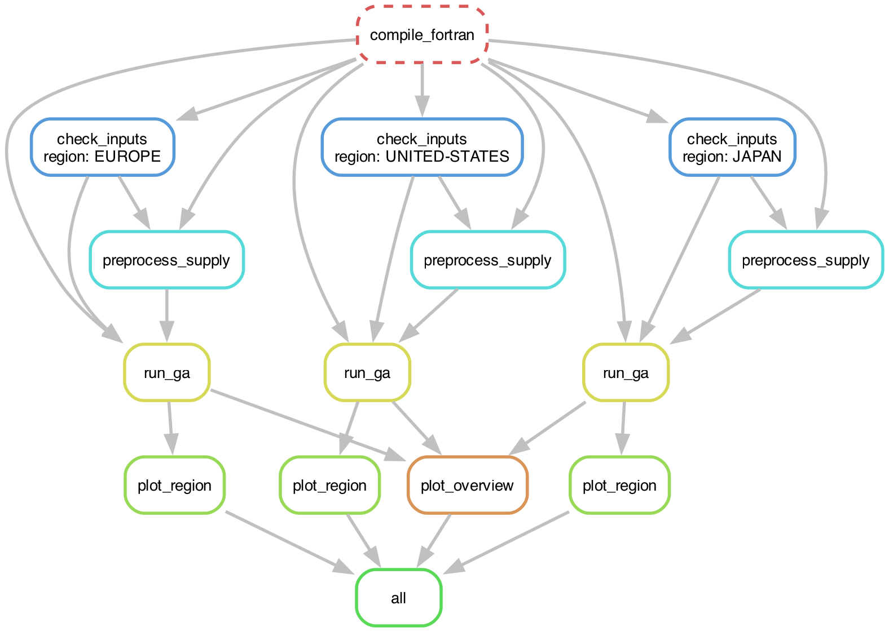

# LoadMatch Python–Fortran Workflow

A Python driver for the **LoadMatch** energy-system simulator (`powerworld.f`),
developed by the Jacobson Lab at Stanford University.  The workflow optimises
the ~30 tunable parameters of the LoadMatch Fortran model using a **Genetic
Algorithm (GA)**, searching for the lowest-cost 100% clean-energy system layout
for any of the supported world regions.  Results are compared against the
Jacobson-group baseline and summarised in a set of figures.

---

## What this repository does

1. **Parses the Jacobson-group baseline** (`xxEGS.<REGION>`) and stores a
   structured JSON summary of every energy metric.

2. **Extracts region-specific Fortran defaults** directly from `powerworld.f`
   (branch-aware: respects the hardcoded `IMERGH2` and `IFEGS` control
   variables so the correct conditional branch is read).

3. **Runs the LoadMatch Fortran simulator** (`powerworld.f`, ~21 000 lines)
   with a given set of factors via a `READ_FACTOR_OVERRIDES` subroutine, and
   parses the full output into ~50 structured metrics (TWh by
   source/end-use/storage, annual cost lo/mn/hi, cost by category in c/kWh).

4. **Optimises with a parallel Genetic Algorithm** — up to 24 parallel Fortran
   evaluations per generation across all CPU cores — minimising annual system
   cost while maintaining feasibility (all demand met).

5. **Generates a complete figure set** (15 main figures + 3 multi-region
   overview figures) automatically at the end of every run:
   - GA cost convergence, capacity-factor and parameter trajectories
   - Generation and storage capacity comparison across four cases (Baseline, LP, GA (bl), GA (LP))
   - Land area demand, cost breakdown, and cost waterfall by category
   - Wind/solar/water Sankey energy-flow diagrams for all four cases
   - LP → first-feasible → GA-optimal feasibility progression (Fig 15, LP warm-start only)
   - Cross-region convergence, wind/solar scatter, and ternary composition plots

6. **Scales to any supported world region** via command-line argument — no
   changes to `powerworld.f` required.  Supports all 29+ regions defined in
   the Fortran source.

---

## Repository layout

```
loadmatch-python/
├── Snakefile                          # Snakemake pipeline (all rules)
├── config/
│   └── workflow.yaml                  # Default regions + GA parameters
├── profiles/
│   └── slurm/
│       └── config.yaml                # SLURM cluster profile for Snakemake
├── src/
│   ├── io/
│   │   └── dat_parser.py              # Read/write .dat key=value files
│   └── optimization/
│       └── model_builder.py           # Pyomo LP model (optional warm-start)
├── scripts/
│   ├── run_full_workflow.py           # GA + Fortran driver (--no-plots / --preprocess-only / --run-lp-only)
│   ├── check_inputs.py                # Validate required data files (called by Snakemake)
│   ├── parse_fortran_output.py        # Parse Fortran stdout → structured JSON
│   ├── plot_results.py                # All figures (--all-regions flag)
│   ├── run_python_model.py            # Standalone Pyomo LP (optional)
│   ├── export_fortran_factors.py      # Convert LP results → fortran_factors.dat
│   ├── factor_history_tools.py        # Parse/plot optimisation history
│   ├── run_all_regions.sh             # All 29 regions — run from login node
│   ├── run_select_regions.sh          # 10 curated regions — run from login node
│   └── run_europe.sh                  # EUROPE only — run from login node (testing)
├── fortran/
│   ├── src/powerworld.f               # LoadMatch Fortran source (~21 000 lines)
│   └── bin/powerworld                 # Compiled executable (x86_64 Linux only)
├── data/
│   ├── raw/                           # Canonical inputs (shared across regions)
│   │   ├── countrystats.dat
│   │   ├── loadreg.COUNTRY2030GW
│   │   ├── heatcooldd.dat
│   │   ├── heatfrac.dat
│   │   ├── wwssupworld.<REGION>       # Hourly supply profiles (~470 MB each)
│   │   └── xxEGS.<REGION>            # Jacobson-group Fortran output used as baseline reference
│   ├── results_python/<REGION>/       # LP outputs (optional)
│   ├── results_verification/<REGION>/ # Fortran logs, factor history, summaries
│   └── results_verification/          # Cross-region overview figures (figA1–A3)
├── logs/                              # Snakemake + SLURM logs
├── docs/                              # dag.png and other documentation assets
├── requirements.txt
└── README.md
```

---

## Setup

### 1. Python environment

```bash
python3 -m venv .venv
source .venv/bin/activate
pip install -r requirements.txt
```

### 2. Compile the Fortran executable

Must be compiled on **x86_64 Linux** (Sherlock or any Linux workstation).
Apple Silicon is not supported by `gfortran -mcmodel=medium`.

```bash
mkdir -p fortran/build fortran/bin
gfortran -O2 -mcmodel=medium \
    -fdefault-real-8 -fdefault-double-8 -fno-automatic \
    -J fortran/build \
    fortran/src/powerworld.f \
    -o fortran/bin/powerworld
```

> **Note:** `-mcmodel=medium` (not `large`) is required — the model's static
> data arrays exceed the 2 GB limit of the default small model but `-mcmodel=large`
> is not supported by all gfortran versions on Sherlock.

### 3. Input data

All files live in `data/raw/`.  The Fortran binary expects the working directory
to be the repository root when invoked.

| File | Contents |
|------|----------|
| `countrystats.dat` | Base capacities and statistics for all regions |
| `loadreg.COUNTRY2030GW` | Hourly electricity demand for all countries (real values) |
| `heatcooldd.dat` | Heating/cooling degree days |
| `heatfrac.dat` | Monthly heat/cold fractions |
| `wwssupworld.<REGION>` | Hourly wind/solar supply profiles per region (~470 MB each) |
| `xxEGS.<REGION>` | Jacobson-group Fortran output used as baseline reference |

> **Supply file preprocessing:** The first time a region is run, Fortran
> auto-generates `wwsmonthly.<REGION>` from `wwssupworld.<REGION>` (IFREWRITE=3).
> This one-time step can take 10–20 minutes for large regions (e.g. UNITED-STATES).
> Subsequent runs skip it automatically.

---

## Snakemake workflow

The entire pipeline is described in the `Snakefile` at the repo root.
Snakemake tracks input/output dependencies and only reruns rules whose
outputs are stale or missing — making it safe to restart interrupted runs.

### Rule dependency graph (DAG)



*Shown for 3 representative regions; the full 29-region graph follows the same structure.*

**Rule execution order (per region):**

```
compile_fortran
      │
check_inputs          ← validates all required data files exist (exits on error)
      │
preprocess_supply     ← runs IFREWRITE=1,2 if wwssupworld.{region} missing
      │
[run_lp]              ← optional LP warm-start (lp_warmstart: true in config)
      │
run_ga                ← GA optimisation (--no-plots)
      │
plot_region           ← per-region figures (fig1–fig13)
      │ (all regions done)
plot_overview         ← cross-region figA1–A3
      │
     all
```

`run_lp` is only included in the DAG when `lp_warmstart: true` is set in
`config/workflow.yaml` and a compatible LP solver is installed.

To regenerate the DAG image at any time (requires `graphviz`):
```bash
# 3-region illustration (readable); requires actual data/raw files to exist
.venv/bin/snakemake --dag \
    --config "regions=[UNITED-STATES,EUROPE,JAPAN]" \
    | dot -Tpng -Grankdir=TB -Gsize="10,12" -Gdpi=200 \
    -o docs/dag.png
```

### Common commands

```bash
# ── Local (laptop / interactive node) ────────────────────────────────────────

# Dry-run: print what would be executed without running anything
.venv/bin/snakemake --cores 1 --dryrun all

# Run the full pipeline for all regions locally (N = number of CPUs)
.venv/bin/snakemake --cores N all

# ── SLURM cluster (Sherlock) ──────────────────────────────────────────────────
# Run Snakemake directly from the login node — it submits SLURM jobs itself.
# Use screen or tmux to keep it alive across disconnects.

screen -S loadmatch   # or: tmux new -s loadmatch

# All 29 regions
bash scripts/run_all_regions.sh

# 10-region curated subset
bash scripts/run_select_regions.sh

# EUROPE only (for testing)
bash scripts/run_europe.sh

# Force-rerun specific rules (e.g. after a code change), all regions:
bash scripts/run_all_regions.sh --forcerun plot_region plot_overview

# Run a single region's full pipeline
.venv/bin/snakemake --profile profiles/slurm --jobs 1 \
    data/results_verification/EUROPE/.plots_done

# Dry-run to see what would be submitted
.venv/bin/snakemake --profile profiles/slurm --jobs 29 --dryrun all

# Check status of all rules across regions
.venv/bin/snakemake --profile profiles/slurm --summary

# Monitor running jobs
squeue -u $USER
tail -f logs/run_ga_EUROPE.log
tail -f data/results_verification/EUROPE/factor_history.log
```

### Configuration

Edit `config/workflow.yaml` to change which regions are run or to adjust GA
hyper-parameters without modifying the Snakefile:

```yaml
# Run only a subset of regions
regions:
  - UNITED-STATES
  - EUROPE
  - JAPAN

# Tune the GA
ga:
  population:  50
  generations: 100

# Enable LP warm-start (requires Gurobi or HiGHS)
lp_warmstart: true
```

Pass a one-off override without editing the file:
```bash
snakemake --cores 24 \
    --config ga.generations=100 \
    data/results_verification/EUROPE/optimal_summary.json
```

#### LP warm-start (`lp_warmstart`)

When `lp_warmstart: true`, the `run_lp` rule runs the Pyomo LP optimiser for
each region **before** the GA and uses the resulting capacity factors as the GA
starting point.  Requires a working LP solver in the Python environment:

```bash
pip install highspy      # HiGHS (open-source, recommended)
# or
pip install gurobipy     # Gurobi (requires licence)
```

When `lp_warmstart: false` (default), the GA starts from:
1. `data/raw/baseline_results.<REGION>.dat` — if present
2. Fortran hardcoded region defaults — otherwise

#### LP techno-economic assumptions (`src/optimization/model_builder.py`)

The LP objective uses cost parameters drawn directly from `powerworld.f`, so the LP and
the GA minimise the same cost function.  The key settings are:

| Assumption | LP value | Fortran source |
|---|---|---|
| Discount rate | 2% (DISCOUNTM) | social rate for intergenerational projects |
| Generator lifetimes | 30 yr (wind/PV/CSP), 35 yr (solar thermal) | YEARLIFEM = (YEARLIFEL+YEARLIFEH)/2 |
| Storage lifetimes | 32.5 yr most, 17 yr battery, 40 yr firebrick, 15 yr H2 tank | STORLIFEM / STORLIFBM / STORLIFHBM |
| Storage O&M | 1.5%/yr of capital | OPMAINTM |
| Decommissioning | ~2% of capital (approximate) | DECOMCOSTM |

**Generator capital costs** (mean of 2022 lo/hi and 2050 lo/hi from the Fortran data arrays):

| Technology | Capital ($/MW) | O&M ($/MW/yr) | Annualised total ($/MW/yr) |
|---|---:|---:|---:|
| Onshore wind | 1,010,000 | 37,500 | 83,500 |
| Offshore wind | 2,336,000 | 80,000 | 186,400 |
| Residential PV | 1,837,000 | 27,500 | 111,200 |
| Commercial PV | 1,266,000 | 16,500 | 74,200 |
| Utility PV | 710,000 | 19,500 | 51,800 |
| CSP turbine + mirrors | 5,326,000 | 50,000 | 292,600 |
| CSP PCM storage (COSTSTORM[IPCMCSP]=20 $/KWh × 36.57 MWh/MW) | — | — | +41,800 |
| Solar thermal | 1,177,000 | 50,000 | 98,000 |

> The CSP PCM material cost is accounted separately in Fortran's `TRILSTORM` loop (not
> bundled into `AVCAPMN(ICSPSTOR)`), so the LP adds it as a proportional surcharge on
> `cspturbfac` using fixed parameters HCHARCSP=14 h and CSPSTORGAT=2.61.

**Storage energy costs** (COSTSTORM $/KWh × 1000, annualised):

| Storage | COSTSTORM ($/KWh) | Lifetime (yr) | Annualised ($/MWh/yr) |
|---|---:|---:|---:|
| Li-ion battery | 60 $/KWh-elec | 17 | 5,098 |
| PHS | 14 $/KWh-elec | 32.5 | 800 |
| HW-STES (hot water) | 3 $/KWh-th × COP=4 = 12 $/KWh-elec | 32.5 | 686 |
| Cold TES (chilled water) | 3 $/KWh-th (COP=1 for cold) | 32.5 | 171 |
| H2 tank | 250 $/kg ÷ 33.3 kWh/kg ÷ H2DCEFF | 15 | 1,230 |
| Firebrick heat battery | 6 $/KWh-th | 40 | 309 |
| UTES (seasonal heat) | 0.4 $/KWh-th × COP=4 = 1.6 $/KWh-elec | 32.5 | 91 |

**H2 power-equipment costs** (annualised installed capital + O&M):

| Component | Installed ($/MW) | O&M | Annualised ($/MW/yr) |
|---|---:|---|---:|
| Electrolyser + rectifier | 535,000 | 7.8%/1%/yr | 57,600 |
| Compressor | 73,500 | 4%/yr | 6,300 |
| Fuel cell | 665,000 | 3.5%/yr | 52,970 |

**Storage efficiencies** (one-way = √round-trip from Fortran):

| Storage | Fortran RT efficiency | One-way used in LP |
|---|---|---|
| Li-ion battery (EFFBAT) | 0.895 | 0.946 |
| PHS (EFFPHS) | 0.80 | 0.894 |
| HW-STES (EFFHSTES) | 0.83 | 0.911 |
| Firebrick heat battery (EFFHTBAT) | 0.98 | 0.990 |
| UTES (EFFUTES) | 0.56 | 0.748 |
| Cold TES (EFFCSTES) | 0.88 | 0.938 |
| H2 round-trip (H2CHAREFF × H2DCEFF) | — | 0.447 |

**Technology coverage by sector:**

| Technology | In LP | Treatment |
|---|---|---|
| Onshore wind | Yes | Decision variable (FACONWIN), full cost |
| Offshore wind | Yes | Decision variable (FACOFFWIN), full cost |
| Residential PV | Yes | Decision variable (FACRESPV), full cost |
| Commercial PV | Yes | Decision variable (FACCOMPV), full cost |
| Utility PV | Yes | Decision variable (FACUTILPV), full cost |
| CSP-with-storage | Yes | Decision variable (CSPTURBFAC); turbine+mirror+PCM costs |
| Solar thermal | Yes | Decision variable (FACSHT), full cost |
| Geothermal electric | Partial | Fixed constant dispatch; capital cost not in objective (capacity not a GA variable) |
| Hydroelectric | Partial | Fixed constant dispatch; capital cost not in objective |
| Tidal | Partial | Fixed constant dispatch; capital cost not in objective |
| Wave | Partial | Fixed constant dispatch; capital cost not in objective |
| EGS geothermal | Partial | Fixed constant dispatch; capital cost not in objective |
| Geothermal heat | Partial | Fixed constant heat supply; capital cost not in objective |
| Li-ion battery | Yes | Power + energy decision variables; energy-only cost (per COSTSTORM) |
| PHS | Yes | Energy decision variable (STORHPHS); power rate fixed from load data |
| HW-STES | Yes | Energy decision variable (STORHHWAT); power rate fixed from load data |
| Cold TES (CW-STES) | Yes | Energy decision variable (STORHCOLD); power rate fixed from load data |
| UTES seasonal | Yes | Energy decision variable (STORUGDYS); power rate fixed from load data |
| Firebrick heat battery | Yes | Power + energy decision variables; energy-only cost (per COSTSTORM) |
| H2 (electrolyser) | Yes | Power decision variable (FCCHARG/h2_chg_mw); full equipment cost |
| H2 (fuel cell) | Yes | Power decision variable (FCDISCH/h2_fc_mw); full equipment cost |
| H2 (tank) | Yes | Energy decision variables (h2_energy_mwh + h2_seasonal_mwh); tank cost |
| PCM-ICE cold storage | No | Inactive in Fortran (commented out); correctly absent |
| Heat pumps for STES/UTES | Partial | Charging included in heat balance; capital cost is constant (not in objective since power rates are fixed) |

### New flags added to Python scripts

| Script | Flag | Effect |
|--------|------|--------|
| `run_full_workflow.py` | `--no-plots` | Skip figure generation after GA (Snakemake handles plots as a separate rule) |
| `run_full_workflow.py` | `--preprocess-only` | Run IFREWRITE=1,2 supply preprocessing only, then exit (used by `preprocess_supply` rule) |
| `run_full_workflow.py` | `--run-lp-only` | Run LP optimisation and export factors only, then exit (used by `run_lp` rule) |
| `plot_results.py` | `--all-regions` | Only regenerate cross-region overview figures (figA1–A3); skip per-region figures |

---

## Running the workflow (standalone, without Snakemake)

### Single region (local or Sherlock interactive)

```bash
source .venv/bin/activate
python -m scripts.run_full_workflow \
    --region UNITED-STATES \
    --optimizer ga \
    --parallel-evals 8 \
    --ga-population 20 \
    --ga-generations 30 \
    --baseline-start defaults
```

**What happens, step by step:**

1. Parses `data/raw/xxEGS.<REGION>` → `canonical_baseline_summary.json`
2. Extracts region-specific Fortran defaults from `powerworld.f` (branch-aware)
3. Runs Fortran with those defaults → `fortran_baseline_run.out` + `baseline_summary.json`
4. If infeasible, inflates capacity factors until a feasible starting point is found
5. Runs the GA for the specified number of generations, evaluating `--parallel-evals`
   candidates simultaneously using `ProcessPoolExecutor`
6. Re-runs Fortran with the best-found factors → `fortran_optimal_run.out` + `optimal_summary.json`
7. Generates figures and saves them to `data/results_verification/<REGION>/`
8. Generates cross-region overview figures in `data/results_verification/`
   (including any other regions that have already completed)

### Settings for Sherlock (24 CPUs)

```bash
python -m scripts.run_full_workflow \
    --region UNITED-STATES \
    --optimizer ga \
    --parallel-evals 24 \
    --ga-population 37 \
    --ga-generations 50 \
    --ga-mutation-rate 0.15 \
    --ga-mutation-scale 0.2 \
    --ga-elite-frac 0.2 \
    --ga-mutation-cooling 0.985 \
    --baseline-start defaults
```

### Output files

All results land in `data/results_verification/<REGION>/`:

| File | Contents |
|------|----------|
| `baseline_reference_summary.json` | Parsed Jacobson-group baseline (~50 metrics) |
| `baseline_summary.json` | Fortran run with region default factors |
| `optimal_summary.json` | Fortran run with GA-optimal factors |
| `genetic_factors.dat` | Best-found factor values (KEY = VALUE format) |
| `factor_history.log` | Full log of every Fortran evaluation (factor values + cost) |
| `fortran_baseline_run.out` | Full Fortran stdout for the baseline run |
| `fortran_optimal_run.out` | Full Fortran stdout for the optimal run |
| `fortran_stdout.log`, `fortran_stderr.log` | Latest Fortran console output |
| `fig*.pdf` / `fig*.png` | Figures |

Cross-region overview figures are saved to `data/results_verification/`:

| File | Contents |
|------|----------|
| `figA1_all_regions_convergence.{pdf,png}` | Cost reduction (%) vs GA generation per region |
| `figA2_all_regions_wind_solar.{pdf,png}` | Wind vs solar energy share scatter |
| `figA3_all_regions_ternary.{pdf,png}` | Wind–Solar–Water ternary composition |

### CLI reference

| Flag | Default | Description |
|------|---------|-------------|
| `--region` | `UNITED-STATES` | Region name matching `GRIDUSE` in `powerworld.f` |
| `--optimizer {hj,ga}` | `hj` | Optimiser (GA recommended) |
| `--parallel-evals N` | 1 | Parallel Fortran evaluations (set = CPU count) |
| `--baseline-start {defaults,PATH}` | — | `defaults`: use Fortran hardcoded region values; `PATH`: load from `.dat` file; omit to run LP first |
| `--ga-population` | 24 | GA population size (odd numbers work well) |
| `--ga-generations` | 50 | Number of GA generations |
| `--ga-mutation-rate` | 0.15 | Per-factor mutation probability |
| `--ga-mutation-scale` | 0.2 | Relative mutation magnitude |
| `--ga-elite-frac` | 0.2 | Fraction of population preserved unchanged |
| `--ga-mutation-cooling` | 0.98 | Per-generation decay applied to rate and scale |
| `--hj-initial-step` | 0.2 | Relative step size (Hooke–Jeeves) |
| `--hj-shrink` | 0.7 | Step reduction factor after no improvement |
| `--hj-max-iter` | 40 | Maximum Hooke–Jeeves iterations |

---

## Parameters (PARAM_REGISTRY)

All parameters are registered in `PARAM_REGISTRY` in `scripts/run_full_workflow.py`.
Parameters with category `"fixed"` are **locked** — they are passed to Fortran but never
mutated by the GA.  Fixed parameters still appear in Fig 4 with a greyed-out style.

### Optimised parameters (GA design variables)

These 14 parameters are actively mutated during optimisation.  The default values listed
are the CONUS (United States) hardcoded Fortran defaults; region-specific defaults are
parsed at runtime from `powerworld.f` by `extract_fortran_region_defaults()`.

| Parameter | Default (CONUS) | Unit | Description |
|-----------|----------------|------|-------------|
| `FACONWIN` | 1.0 | — | Onshore wind capacity scaling factor |
| `FACOFFWIN` | 1.0 | — | Offshore wind capacity scaling factor |
| `FACUTILPV` | 1.0 | — | Utility-scale PV capacity scaling factor |
| `FACRESPV` | 1.0 | — | Residential rooftop PV capacity scaling factor |
| `FACCOMPV` | 1.0 | — | Commercial rooftop PV capacity scaling factor |
| `CSPTURBFAC` | 1.0 | — | CSP turbine capacity ratio |
| `FACSHT` | 1.0 | — | Solar thermal heat collector scaling factor |
| `BATDISCH` | 1.55 | TW | Battery max discharge rate |
| `STORHBAT` | 4.0 | h | Battery storage duration |
| `STORHCOLD` | 14.0 | h | Cold storage hours (PCM-ice + chilled-water STES) |
| `STORHHWAT` | 14.0 | h | Hot-water STES storage hours |
| `STORHPHS` | 14.0 | h | Pumped-hydro storage hours |
| `STORUGDYS` | 60.0 | days | UTES seasonal heat storage days |
| `DAYH2STOR` | 40.0 | days | H₂ gas storage days |
| `FCDISCH` | 0.091 | TW | H₂ fuel-cell max discharge rate |
| `FCCHARG` | 0.091 | TW | H₂ electrolyser max charge rate |
| `CPERFORM` | 4.0 | kWh-th/kWh-el | Heat pump coefficient of performance (COP) |

> **Note on `FACSHT`:** The GA consistently finds near-zero values for some regions
> (e.g. the United States) because the model prefers heat-pump-based heating — driven
> by cheap wind/solar electricity — over dedicated solar thermal collectors.  This is a
> genuine economic result, not a Fortran artefact.

### Fixed parameters (not optimised)

These parameters are held at their default values throughout the run.  They are divided
into three sub-groups: parameters locked because Fortran internally overrides them
regardless of the factor file; parameters that represent policy or structural constraints
that should not be treated as design variables; and numerical/tuning constants.

#### Locked due to Fortran internal overrides

| Parameter | Default | Unit | Fortran behaviour | Reason for locking |
|-----------|---------|------|-------------------|--------------------|
| `STORHHFC` | 0.0 | h | Initialised to `0` at line 1138 of `powerworld.f` and only meaningful when `IMERGH2=2`. The model runs with `IMERGH2=1` (merged grid/non-grid H₂), so this field is never used. | Inert — optimising it wastes GA budget. |
| `HBTDISCH` | 0.0 | TW | Overwritten at runtime by `HOTINDDEM` (industrial hi-temp heat demand, line 10073), regardless of the value supplied in `fortran_factors.dat`. | Inert — runtime override makes it non-optimisable. |
| `STORHHBT` | 15.0 | h | Heat battery energy capacity = `HBTDISCH × STORHHBT`. Since `HBTDISCH` is overwritten by load data, `STORHHBT` has no independent effect. | Consequentially inert. |

#### Policy / structural constraints

| Parameter | Default | Unit | Description | Reason for locking |
|-----------|---------|------|-------------|--------------------|
| `CSPSTORGAT` | 2.61244594 | — | CSP storage charge/discharge ratio | Physical property of molten-salt CSP storage; not a design variable. |
| `HCHARCSP` | 14.0 | h | CSP max charge hours | Fixed by CSP plant design; not an independent optimisation target. |
| `UGFAC` | 3.0 | — | UTES charge rate factor (relative to discharge) | Structural constraint of underground thermal energy storage. |
| `HPTURBRAT` | 10.0 | — | Hydro turbine discharge ratio (nameplate / mean annual) | Physical/regulatory constraint on hydro dam operation. |
| `DAMCAPRAT` | 0.583 | — | Hydro dam capacity / annual energy output | Derived from existing dam inventory; not a design variable. |
| `DAYBASHYD` | 360.0 | days | Baseload hydro storage days | Reflects existing reservoir capacity. |
| `MXHRDRM` | 11.0 | h | Maximum demand-response shift hours | Policy/consumer constraint; not varied. |
| `COOLSTES` | 0.4 | — | Fraction of AC cooling supplied by chilled-water STES vs PCM-ice | Infrastructure split; treated as given. |
| `PHSMIN` | 0.016 | TW | Minimum pumped-hydro nameplate capacity | Numerical floor to prevent degenerate solutions. |
| `FHEATFLX` | 0.15 | — | Flexible heat load fraction (demand response) | Policy assumption; fixed for comparability across regions. |
| `FCOLDFLX` | 0.15 | — | Flexible cold load fraction (demand response) | Policy assumption; fixed for comparability across regions. |
| `FRSTORINIT` | 0.5 | — | Initial storage fill fraction at simulation start | Initial condition; arbitrary but symmetric. |
| `FDISTHEAT` | 0.2 | — | District heating penetration fraction | Structural assumption about building stock. |
| `FRCIHFLEX` | 0.5 | — | Flexible industrial heat fraction | Policy assumption; fixed for all regions. |

#### Numerical / health constants

| Parameter | Default | Unit | Description | Reason for locking |
|-----------|---------|------|-------------|--------------------|
| `HWFAC` | 1.0 | — | Hot-water STES charge rate factor | Scaling identity; not a meaningful design variable. |
| `HCDDADD` | 1.0 | — | HDD/CDD daily minimum (numerical safeguard) | Prevents division-by-zero in heating/cooling degree-day calculations. |
| `FMORTBAU` | 0.9 | — | BAU air-pollution mortality fraction | Epidemiological input; fixed by scenario definition. |

---

## Multi-region SLURM runs (Stanford Sherlock)

Snakemake runs directly on the login node and submits each rule as an
individual SLURM job via `--profile profiles/slurm`.  Three convenience
scripts set up the environment and launch Snakemake with the right arguments.
Run them inside `screen` or `tmux` so they survive disconnects.

### Available scripts

| Script | Regions |
|--------|---------|
| `scripts/run_all_regions.sh` | All 29 world regions |
| `scripts/run_select_regions.sh` | 10 curated regions (see below) |
| `scripts/run_europe.sh` | EUROPE only (for testing) |

All scripts accept extra Snakemake flags, e.g.:
```bash
bash scripts/run_all_regions.sh --forcerun plot_region plot_overview
bash scripts/run_all_regions.sh --dryrun
```

### Curated 10-region set (`run_select_regions.sh`)

Chosen for geographic diversity and resource contrast:

| Index | Region | Rationale |
|-------|--------|-----------|
| 0 | `UNITED-STATES` | Reference; high solar/wind/hydro mix |
| 1 | `CANADA` | Hydro-dominant |
| 2 | `EUROPE` | Policy-critical; high offshore wind |
| 3 | `CHINA` | Largest emitter; rapid buildout |
| 4 | `INDIA` | Fast-growing demand; high solar |
| 5 | `JAPAN` | Island; limited domestic resource base |
| 6 | `AUSTRALIA` | High solar and wind resource |
| 7 | `AFRICA-EAST` | Geothermal-rich; developing |
| 8 | `SOUTHEAST-ASIA` | Tropical; biomass + solar |
| 9 | `RUSSIA` | Cold climate; fossil-heavy baseline |

### All 29 world regions (`run_all_regions.sh`)

`AFRICA-EAST`, `AFRICA-NORTH`, `AFRICA-SOUTH`, `AFRICA-WEST`, `AUSTRALIA`,
`CANADA`, `CENTRAL-AMERIC`, `CENTRAL-ASIA`, `CHINA`, `CUBA`, `EUROPE`,
`HAITI`, `ICELAND`, `INDIA`, `ISRAEL`, `JAMAICA`, `JAPAN`, `MADAGASCAR`,
`MAURITIUS`, `MIDEAST`, `NEW-ZEALAND`, `PHILIPPINES`, `RUSSIA`, `SOUTHAM-NW`,
`SOUTHAM-SE`, `SOUTHEAST-ASIA`, `SOUTH-KOREA`, `TAIWAN`, `UNITED-STATES`

### Sherlock setup (one-time)

```bash
# On a login node:
module load python/3.12.1

cd $GROUP_HOME/loadmatch-python
python3 -m venv .venv
source .venv/bin/activate
pip install -r requirements.txt

# Compile Fortran on a compute node (srun for x86_64):
srun --partition=serc --cpus-per-task=4 --mem=8G --pty bash
cd $GROUP_HOME/loadmatch-python
mkdir -p fortran/build fortran/bin
gfortran -O2 -mcmodel=medium \
    -fdefault-real-8 -fdefault-double-8 -fno-automatic \
    -J fortran/build fortran/src/powerworld.f \
    -o fortran/bin/powerworld
exit
```

### Run

```bash
# Start a persistent session so Snakemake survives disconnects
screen -S loadmatch          # or: tmux new -s loadmatch

# Recommended: validate with 10-region subset first
bash scripts/run_select_regions.sh

# Full 29-region run
bash scripts/run_all_regions.sh

# Test with EUROPE only
bash scripts/run_europe.sh

# Reattach after disconnect
screen -r loadmatch          # or: tmux attach -t loadmatch
```

### Monitor progress

```bash
squeue -u $USER
tail -f logs/run_ga_<REGION>.log
tail -f data/results_verification/<REGION>/factor_history.log
.venv/bin/snakemake --profile profiles/slurm --summary
```

### Regenerate plots after a code change

```bash
bash scripts/run_all_regions.sh --forcerun plot_region plot_overview
```

### Sync figures to your local machine

```bash
rsync -av sherlock:/path/to/repo/data/results_verification/ ./results_local/
```

---

## Supported world regions

All regions are defined as `ELSEIF (GRIDUSE.EQ.'<NAME>')` blocks in
`powerworld.f`.  The region name is passed as a command-line argument to
the Fortran binary and as `--region` to the Python workflow.

**Main world regions (29):**
`AFRICA-EAST`, `AFRICA-NORTH`, `AFRICA-SOUTH`, `AFRICA-WEST`,
`AUSTRALIA`, `CANADA`, `CENTRAL-AMERIC`, `CENTRAL-ASIA`,
`CHINA`, `CUBA`, `EUROPE`, `HAITI`, `ICELAND`, `INDIA`,
`ISRAEL`, `JAMAICA`, `JAPAN`, `MADAGASCAR`, `MAURITIUS`,
`MIDEAST`, `NEW-ZEALAND`, `PHILIPPINES`, `RUSSIA`,
`SOUTHAM-NW`, `SOUTHAM-SE`, `SOUTHEAST-ASIA`, `SOUTH-KOREA`,
`TAIWAN`, `UNITED-STATES`

**Additional European sub-regions:**
`NORDEN`, `NORDENSWEGER`, `NODESWGENEBELU`, `SWIGER`, `SWIFRA`, `SWIITA`,
`NWEUROPE`, `SPAPORGIB`, `WESTEUROPE`, `GERMANY`, `UNITED-KINGDOM`, `FRANCE`,
`NORWAY`, `SWEDEN`, `DENMARK`, `NETHERLANDS`, `BELGIUM`, `LUXEMBOURG`,
`SWITZERLAND`, `SPAIN`, `PORTUGAL`, `GIBRALTAR`, `ITALY`,
`GRAN-CANARIA`, `LANZAROTE-FV`, `TENERIFE`, `LA-PALMA`, `LA-GOMERA`, `EL-HIERRO`

Each region requires `data/raw/wwssupworld.<REGION>` and optionally
`data/raw/xxEGS.<REGION>` for baseline comparison.

---

## Figures generated

All figures are saved as both `.pdf` and `.png`
(8 pt Helvetica/Arial, Okabe-Ito CVD-safe palette, no top/right spines, 300 dpi).

Per-region figures (fig1–fig15) are generated by the `plot_region` and
`plot_four_cases` Snakemake rules (or by `scripts/plot_results.py` standalone).
Figures 14 and 15 require `lp_warmstart: true` in `config/workflow.yaml`.

| Figure | Filename stem | Rule | Contents |
|--------|---------------|------|----------|
| 1 | `fig1_cost_convergence` | `plot_region` | GA cost convergence curve + feasibility rate per generation |
| 2 | `fig2_capacity_factors` | `plot_region` | Capacity-factor trajectories of the best feasible individual per generation |
| 3 | `fig3_parameter_trajectories` | `plot_region` | All optimised parameter trajectories, grouped into 5 panels |
| 4 | `fig4_baseline_vs_ga` | `plot_region` | Baseline vs GA-optimal bar comparison for every parameter; fixed params greyed-out at bottom |
| 5 | `fig5_cost_and_capacity` | `plot_region` | A: cost-distribution boxplots; B: total annual cost; C/D: generation capacity (GW) and energy storage (TWh) at baseline, intermediate, and GA-optimal milestones |
| 6 | `fig6_parameter_sensitivity` | `plot_region` | Coefficient of variation (CV) of each optimised parameter across the final feasible GA population |
| 7 | `fig7_capacity_comparison` | `plot_region` | Generation capacity (GW), storage power (TW), and storage energy (TWh): baseline vs GA-optimal, 3 panels |
| 8 | `fig8_area_comparison` | `plot_region` | Land area demand by technology and total footprint: baseline vs GA-optimal |
| 9 | `fig9_cost_comparison` | `plot_region` | Annual cost breakdown by category (capital + O&M + fuel + health): baseline vs GA-optimal |
| 10 | `fig10_capacity_mix` | `plot_region` | A: installed capacity mix; B: wind vs solar share scatter across all candidates; C: Wind–Solar–Water ternary diagram |
| 11 | `fig11_diversity_heatmap` | `plot_region` | Parameter diversity heatmap across the final GA generation (feasible individuals only) |
| 12 | `fig12_cost_waterfall` | `plot_region` | Cost waterfall: contribution of each parameter change from baseline to GA-optimal |
| 13a | `fig13_sankey_energy_flow` | `plot_region` | Sankey energy-flow diagram — baseline scenario |
| 13b | `fig13_sankey_energy_flow_optimal` | `plot_region` | Sankey energy-flow diagram — GA-optimal scenario |
| 13c | `fig13_sankey_energy_flow_lp` | `plot_four_cases` | Sankey energy-flow diagram — LP-optimal scenario |
| 13d | `fig13_sankey_energy_flow_lp_ga` | `plot_four_cases` | Sankey energy-flow diagram — GA-from-LP-optimal scenario |
| 14 | `fig14_four_case_comparison` | `plot_four_cases` | Four-case bar comparison: Baseline, LP-optimal, GA(baseline), GA(LP) — cost, generation, storage |
| 15 | `fig15_lp_feasibility_path` | `plot_four_cases` | Three-step path from raw LP solution → first inflate-feasible → GA(LP)-optimal, showing cost, generation capacity, and storage parameters |
| A1 | `figA1_all_regions_convergence` | `plot_overview` | *(cross-region)* Cost reduction (%) vs GA generation for all regions |
| A2 | `figA2_all_regions_wind_solar` | `plot_overview` | *(cross-region)* Wind vs solar energy share scatter across all regions |
| A3 | `figA3_all_regions_ternary` | `plot_overview` | *(cross-region)* Wind–Solar–Water ternary composition across all regions |

Cross-region figures (figA1–A3) are regenerated automatically after all regions finish
and accumulate all available results.

---

## Key implementation notes

### Factor file mechanism

The Fortran binary reads `READ_FACTOR_OVERRIDES` (a subroutine appended to
`powerworld.f`) immediately after setting all region-specific defaults.  The
subroutine opens `data/raw/fortran_factors.dat`, reads KEY = VALUE pairs, and
overrides the matching Fortran variables.  If the file is absent, all hardcoded
region defaults are used unchanged.

When `--baseline-start defaults` is used, the Python workflow deletes any
existing factor file before the baseline run so Fortran uses its hardcoded
values, then writes a factor file for every subsequent GA evaluation.

### Branch-aware default extraction

`extract_fortran_region_defaults()` in `run_full_workflow.py` parses
`powerworld.f` to read the actual runtime values of each parameter for a given
region.  It is aware of `IF/ELSEIF/ELSE/ENDIF` chains conditioned on `IMERGH2`
and `IFEGS` (both hardcoded in `powerworld.f`) and only reads values from the
branch that executes at runtime.

Conditionals on **unknown** variables (e.g. `FRCLDEGS`, `IFNEWLOAD`) are treated
as **opaque blocks**: an `unrecognized_depth` counter tracks nesting depth, and
any assignments inside an opaque block are silently skipped.  This prevents
incorrect defaults being extracted (e.g. `BATDISCH=0` from a dead branch in the
EUROPE block), which would otherwise make every GA evaluation infeasible.

### Supply file preprocessing (IFREWRITE)

The first run for a region triggers IFREWRITE=3, which reads
`wwssupworld.<REGION>` and writes `wwsmonthly.<REGION>`.  This is automatic
and region-agnostic.  Subsequent runs set IFREWRITE=0 and skip preprocessing.
The preprocessing step can take 10–20 minutes for large supply files.

### Parallel GA evaluations

Each GA generation evaluates the population using `ProcessPoolExecutor` with
`--parallel-evals` workers.  Each worker gets an isolated workspace directory
under `data/tmp_workspaces/` to avoid file conflicts between concurrent Fortran
processes.  Set `--parallel-evals` equal to the number of available CPUs.

### Load data format

The `loadreg.COUNTRY2030GW` file contains hourly electricity demand per country
as real-valued GW.  The Fortran source was updated to read these as
floating-point (`RLOADMW`) rather than integer (`ILOADMW`) to support countries
with sub-GW or fractional demand values (e.g. Cyprus, small island states).

---

## Troubleshooting

| Symptom | Cause / Fix |
|---------|-------------|
| `ModuleNotFoundError: No module named 'src'` | Run from repo root with `python -m ...` or `export PYTHONPATH=$(pwd)` |
| `Relocation truncated` linker error | Add `-mcmodel=medium` to the gfortran compile command |
| `Bad integer` error in Fortran for small countries | Rebuild Fortran after the RLOADMW fix (already in source) |
| US baseline infeasible / long inflate loop | Rebuild Fortran — hardcoded US defaults were corrupted with optimisation results; fixed in source |
| GA produces only infeasible solutions | Run HJ first (`--optimizer hj`) to find a feasible region, then restart GA from that point |
| Supply preprocessing takes 20+ minutes | Normal for first run of a region; subsequent runs are fast |
| `Solver not available: highs` | Install HiGHS or use `--baseline-start defaults` to skip the LP entirely |
| Figures not generated / plot errors | Run `python -m scripts.plot_results --region <REGION>` manually; check for missing `optimal_summary.json` |
| Snakemake `MissingOutputException` for `optimal_summary.json` | GA run failed or was killed — check `logs/run_ga_<REGION>.log`; resubmit with `--rerun-incomplete` |
| `fortran/bin/powerworld does not exist and compile: false` | Set `compile: true` in `config/workflow.yaml` or pre-build the binary on a compute node |
| Snakemake SLURM profile: `sbatch: command not found` | Profile is only valid on Sherlock; use `snakemake --cores N` for local execution |
| Overview figures (figA1–A3) missing after partial runs | Run `snakemake --cores 1 plot_overview` after at least one region completes |

---

## License

Respect the licensing terms of the original LoadMatch Fortran code and
associated datasets.  Consult the Jacobson Lab before publishing or
redistributing results.
